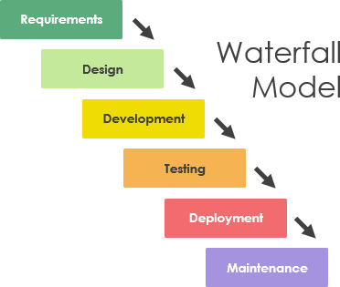
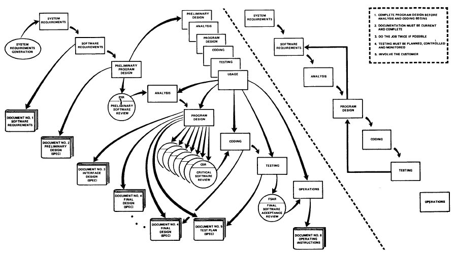
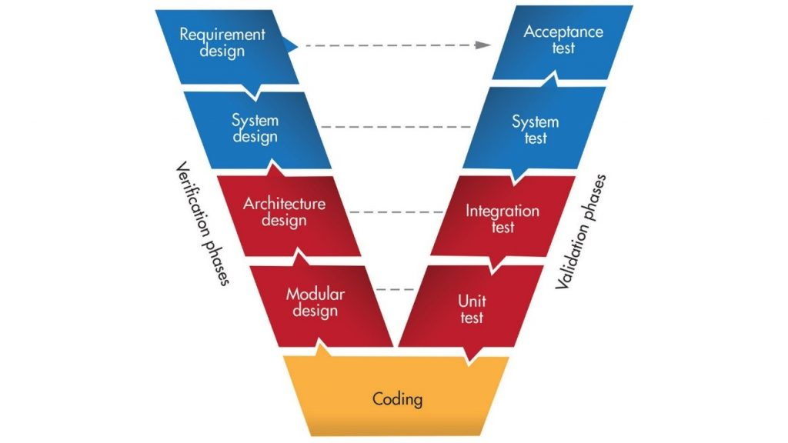
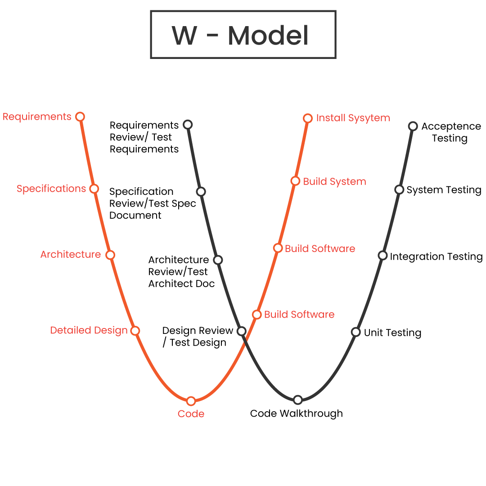
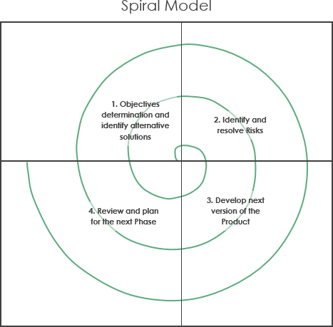
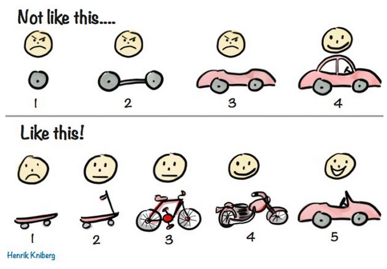
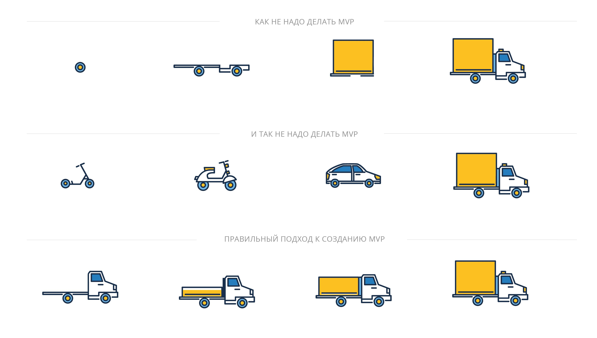
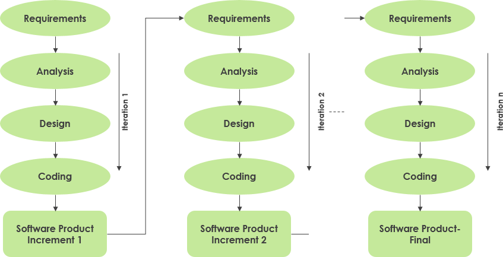
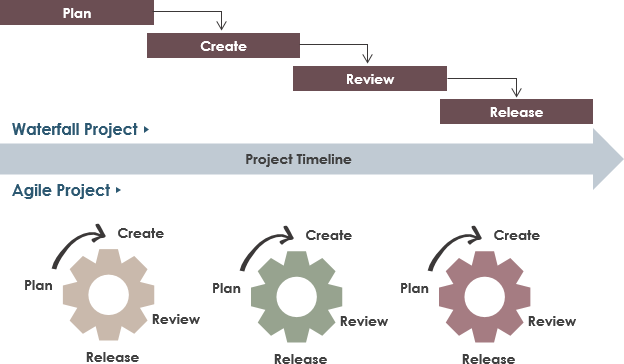

## Водопадная или каскадная модель разработки

- Сбор требований
- Анализ и составление тз
- прототипирование и дизайн
- разработка
- тестирование
- деплой
- поддержка

https://i.imgur.com/ZLjKLE9.png

## Плюсы:
- хорошая, исчерпывающая документация
- Чёткие и понятные требования
- понятные сроки и стоимость разработки

## Минусы

- не гибко, изменение требований часто возвращают на начало и увеличивыют стоимость

## История

Каскадная модель применяется в строительстве. В армии. И за столетия зарекомендовала себя прекрасно. При правильном подходе нет человеческих жертв и экономятся ресурсы.

- госконтракты
- медицина
- маленькие проекты

## Модификация каскадной модели - V-model

Процесс разработки программного обеспечения - это стратегия, при которой продукт проходит различные этапы, такие как создание идеи, организация, создание и тестирование, прежде чем будет передан конечный продукт.

Большая разница в том, что в качестве предварительного условия для модели Waterfall тестирование может происходить только после завершения разработки программного продукта без каких-либо корректировок в середине. Это означает, что W-модель - это очень простой последовательный подход, в котором прогресс идет только в одном направлении.

С другой стороны, V-модель, также называемая моделью проверки и проверки, похожа на водопадную модель, которая использует последовательный способ выполнения процедур. В этом смысле мы можем сказать, что V-модель является альтернативой W-модели, поскольку шаги выполняются в виде требований, проектирования, реализации, проверки и, наконец, обслуживания.

### V-Model

Плюсы:
- всестороннее тестирование

1) Этап проверки включает в себя:
    Обзор бизнес-требований - это подробный обмен информацией, включая точные функции и требования, а также планирование проектирования приемочных испытаний.
    Стадия проектирования системы включает в себя понимание и детальное описание всего оборудования и настройки связи для продукта. Дизайн системного тестирования лучше всего планировать на этом этапе.
    На этапе архитектурного проектирования разрабатывается проект высокого уровня. Наряду с пониманием технической и финансовой осуществимости продукта до его фактической разработки. Интеграционный тест лучше всего планировать на этом этапе.
    Этап проектирования модуля фокусируется на разработке подробного плана для внутренних модулей системы, также известного как проект нижнего уровня. Важно обеспечить совместимость проекта с другими окружающими модулями в архитектуре системы.

2) Фаза кодирования включает в себя
   фактическое кодирование системных модулей. На основе системных и архитектурных требований программы выбирается наиболее подходящий язык программирования. Затем код проверяется и оптимизируется, чтобы обеспечить максимальную производительность, а также модульное тестирование, завершенное разработчиками.

3) Фаза валидации включает:
    Модульное тестирование проводится на ранней стадии, так что ошибки устраняются на ранних стадиях разработки продукта, хотя не все ошибки могут быть выявлены.
    Интеграционное тестирование проводится для проверки наличия действительной и надлежащей связи внутри внутренних модулей системы.
    Системное тестирование - это тестирование всей системы, которое должно убедиться, что внутренние модули настроены для эффективного взаимодействия с внешними системами.
   Приемочное тестирование проводится для тестирования продукта в среде клиента с целью выявления проблем совместимости.

Преимущества модели V:
-Простой и четкий процесс,
которому нужно следовать -Тестирование начинается с самого этапа требований
-Все функциональные области могут быть покрыты
-Дефекты могут быть обнаружены на ранней стадии

При одинаковом определении каждой фазы - проверка требований, проектирование системы, архитектура, низкоуровневое проектирование - использование W-модели помогает гарантировать, что тестирование продукта начнется с самого первого дня разработки продукта.

### W-модель

Преимущества модели W:
-Тестирование может выполняться параллельно с процессом разработки
-Нет разделения на конструктивные и деструктивные задачи
-Часто разработчик отвечает за устранение дефектов

Недостатки модели W
-Сложный для отслеживания прогресса
-Тестирование имеет равный вес и рабочую нагрузку, как много действий в процессе разработки

Вывод
Хотя верно, что V-модель является эффективным способом тестирования и выявления результатов для динамических циклов тестирования, для управления рисками и смягчения их последствий, особенно планирования, не существует возможностей. W-модели более эффективны и позволяют получить более полное представление о тестировании.

Необходимо тщательно выбирать модель, которая лучше работает с доступным объемом ресурсов и сложностью каждого проекта, чтобы создать продукт идеального качества.

## Спиральная - итерационная разработка

https://i.imgur.com/bwkUNIF.png

Плюсы, раннее создание по.
Минусы, не всегда все требования известны в начале

## Минимально жизнеспособный продукт (minimum viable product, MVP) 

## Incremental development

https://i.imgur.com/PohuQFj.png

## Agile vs Watterfall

https://www.visual-paradigm.com/tw/guide/software-development-process/what-is-a-software-development-lifecycle/
